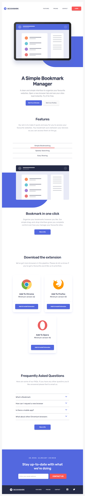
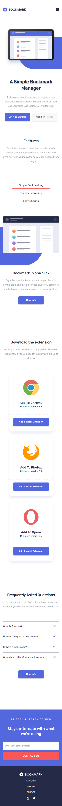

# Frontend Mentor - Bookmark landing page solution

This is a solution to the [Bookmark landing page challenge on Frontend Mentor](https://www.frontendmentor.io/challenges/bookmark-landing-page-5d0b588a9edda32581d29158). Frontend Mentor challenges help you improve your coding skills by building realistic projects.

## Table of contents

-   [Overview](#overview)
    -   [The challenge](#the-challenge)
    -   [Screenshot](#screenshot)
    -   [Links](#links)
-   [My process](#my-process)
    -   [Built with](#built-with)
-   [Author](#author)

## Overview

### Screenshot

-   Desktop

-   Tablet

-   Mobile

### Links

-   Solution URL: [Github](https://github.com/Jojo25011990/bookmark-landing-page)
-   Live Site URL: [Github Pages](https://jojo25011990.github.io/bookmark-landing-page)

## My process

### Built with

-   Desktop-first workflow
-   React
-   Vite
-   TypeScript
-   GSAP
-   Tailwind

## Author

-   Frontend Mentor - [Jojo25011990](https://www.frontendmentor.io/profile/Jojo25011990)
-   Instagram - [web.animations.and.effects](https://www.instagram.com/web.animations.and.effects)
-   Tiktok - [web.anim.and.effects](https://www.tiktok.com/@web.anim.and.effects)
-   Youtube - [web.animations.and.effects](https://www.youtube.com/@web.animations.and.effects)
-   Linkedin - [Jozef Kudrna](https://www.linkedin.com/in/jozef-kudrna-28b580295)
